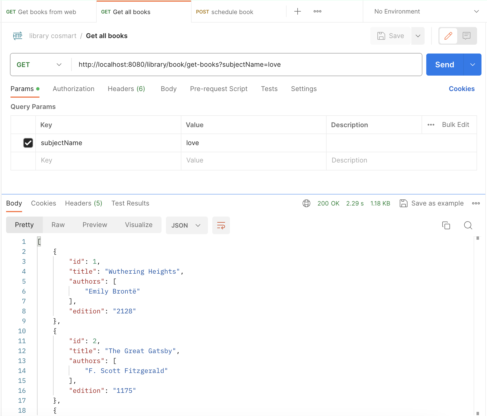
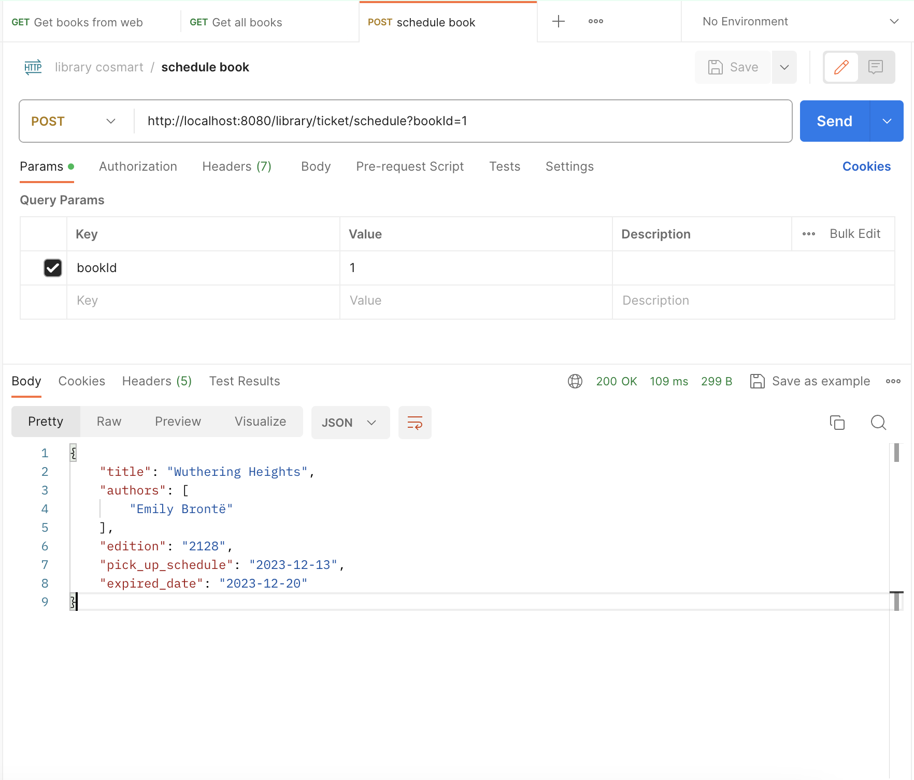

# Library-Cosmart


## Description
The application was built on Spring Boot (as backend service) and PostgreSQL (as database service) with Docker Compose.

## Prerequisite
- Install docker. [Link download](https://docs.docker.com/desktop/) 

Example in Mac Os
```
sudo hdiutil attach Docker.dmg
sudo /Volumes/Docker/Docker.app/Contents/MacOS/install
sudo hdiutil detach /Volumes/Docker
```

## Local Setup
1. Clone Repo
```
cd existing_repo
git remote add origin https://github.com/mfarhanharahap/library-cosmart-project.git
```
2. To build and run use:
```
docker compose up -- build -d
```
3. Using the application:
- Get All Books by Subject (example: love)
```
curl --location 'http://localhost:8080/library/book/get-books?subjectName=love'
```

- Book Schedule (with params bookId)
```
curl --location --request POST 'http://localhost:8080/library/ticket/schedule?bookId=1'
```

4. To stop the application
```
docker compose down
```